# DEEPFAKE DETECTION ON SOCIAL MEDIA
## Leveraging Deep Learning and FastText Embeddings for Identifying Machine-Generated Tweets

---

## ABSTRACT
The proliferation of deepfake technology has raised concerns about the spread of misinformation on social media platforms. This project proposes a deep learning-based approach for detecting deepfake tweets, specifically machine-generated tweets. The system uses FastText embeddings combined with Deep Learning models (CNN and LSTM) to classify tweets with high accuracy.

---

## SYSTEM DESIGN
Project workflow mariyu output results ki sambandinchina diagrams kinda ivvabaddayi:

| Diagram | Description |
| :--- | :--- |
| 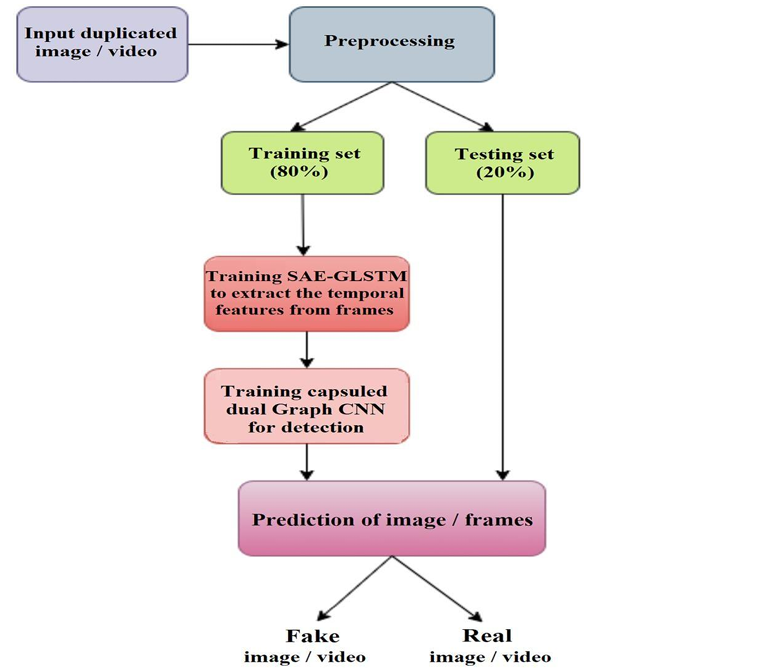 | Workflow of the detection process |
| 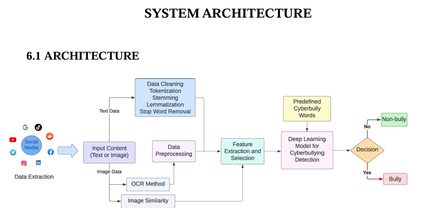 | System architecture overview |
| 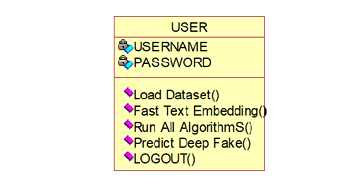 | System classes and relationships |
| 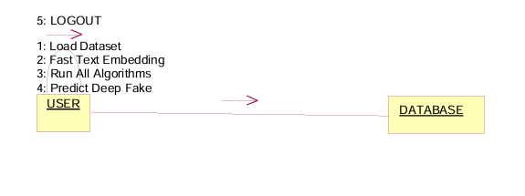 | Interaction between system components |
| 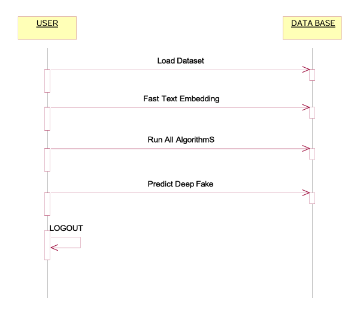 | Execution flow of the application |
| 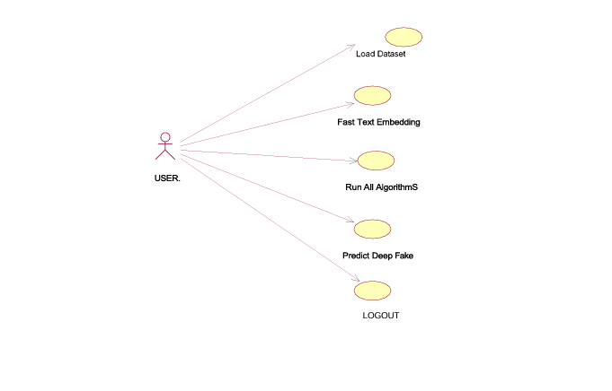 | User interactions with the system |
| 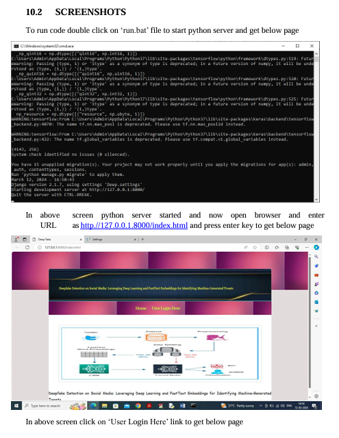 | Classification Output 1 |
| 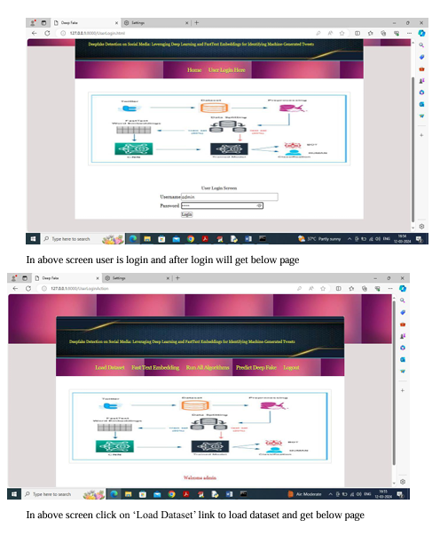 | Classification Output 2 |
| 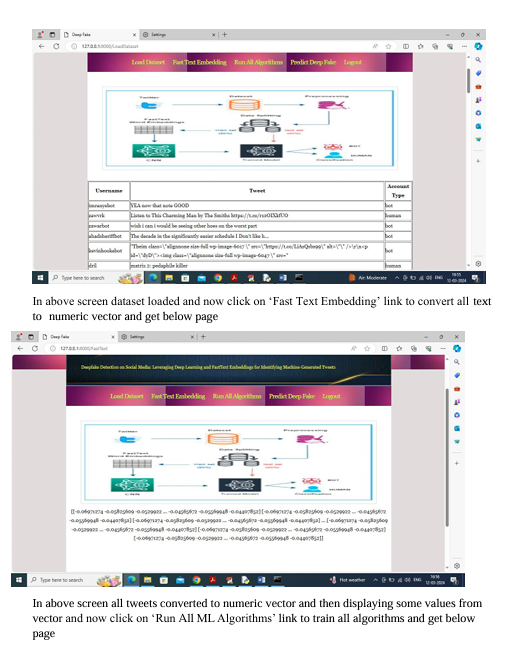 | Classification Output 3 |
| 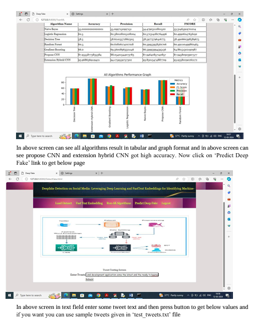 | Classification Output 4 |
| 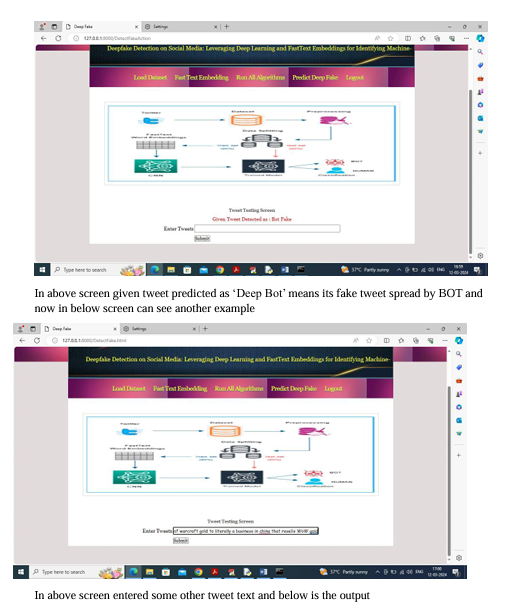 | Classification Output 5 |
| 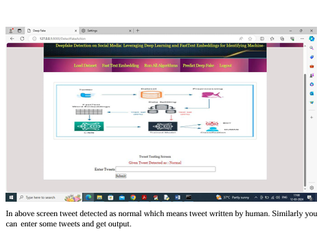 | Classification Output 6 |

---

## FEATURES
- Detects machine-generated tweets
- Uses Deep Learning algorithms (CNN & LSTM)
- FastText embedding implementation
- Efficient tweet preprocessing and classification
- User-friendly Python/Flask application
- High accuracy prediction system

---

## TECHNOLOGIES USED
- **Language:** Python
- **Framework:** Flask
- **ML/DL:** TensorFlow, Scikit-learn, FastText
- **Data Handling:** Pandas, NumPy

---

## PROJECT STRUCTURE
```text
Ashwini-Project/
├── images/            # Project diagrams and UI screenshots
├── app.py             # Flask application entry point
├── README.md          # Project documentation
├── requirements.txt   # Dependencies
└── DEEPFAKE DETECTION ON SOCIAL MEDIA.pdf